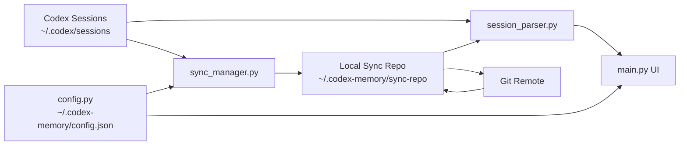

# Codex Memory Sync

一个面向 Codex 会话记录的桌面同步工具。

它用于管理本机 `~/.codex/sessions` 下的 `jsonl` 会话文件，并通过 Git 仓库把这些记录同步到一个“云端缓存”目录，方便你在不同机器之间备份、恢复和排查会话数据。

## 项目能做什么

- 浏览本机 Codex 会话记录
- 浏览 Git 同步仓库中的远端会话记录
- 按 `Provider` 分组折叠会话
- 展示会话时间、标题、文件路径
- 自动从 `thread_name`、`session_index` 或首条用户消息提取标题
- 查看会话中的用户 / Codex 对话内容
- 点击会话路径后直接打开对应目录
- 将本机会话推送到 Git 远端仓库
- 将远端会话恢复到本机 Codex 会话目录
- 修正恢复后本地会话的 `model_provider`
- 删除选中的本地会话文件
- 持久化保存本地目录、同步目录、Git 仓库配置

## 适用场景

- 多台电脑之间同步 Codex 会话历史
- 给 AI 工程助手保留可回溯的历史上下文
- 在迁移机器或切换模型配置后恢复旧会话
- 排查某个会话到底来自本地还是同步仓库
- 批量清理、修正本地会话文件

## 核心特性

### 1. 本地 / 云端双视图

- `本地记录`：直接读取本机 Codex 会话目录
- `云端记录`：读取 Git 同步缓存目录，并在配置了远端仓库时先执行 `pull`

这里的“云端”不是专有云服务，而是你配置的 Git 仓库及其本地缓存目录。

### 2. 会话标题自动提取

标题优先级如下：

1. `jsonl` 中的 `thread_name_updated`
2. `~/.codex/session_index.jsonl` 中的 `thread_name`
3. 首条用户消息自动推断出的简短标题
4. 兜底显示原始文件名

这可以尽量避免列表里大量出现难读的 `rollout-xxxx.jsonl` 文件名。

### 3. 会话恢复与 Provider 修正

从同步仓库恢复到本机后，如果当前 Codex 环境的 `model_provider` 与原会话不一致，可以直接在本地视图中批量执行“修正本地会话”。

### 4. 路径直达

列表第三行展示会话文件路径，点击后会打开对应目录：

- macOS：使用 `open`
- Windows：使用 `os.startfile`
- Linux：使用 `xdg-open`

## 界面预期

左侧列表中的每条会话会按三行展示：

```text
2026-04-28 22:15
实现会话同步客户端
/Users/yourname/.codex/sessions/2026/04/28/rollout-xxxx.jsonl
```

## 运行环境

- Python `3.10+`
- Git
- Tk / tkinter
- 支持 macOS、Windows，代码中也保留了 Linux 打开目录分支

## 依赖安装

当前仓库没有单独维护 `requirements.txt`，最少依赖如下：

- `customtkinter`
- `GitPython`

推荐先创建虚拟环境。

### macOS / Linux

```bash
python3 -m venv .venv
source .venv/bin/activate
pip install customtkinter GitPython
python main.py
```

### Windows

```powershell
python -m venv .venv
.venv\Scripts\activate
pip install customtkinter GitPython
python main.py
```

## 首次使用

1. 启动程序
2. 点击“设置”
3. 配置以下三项：

- `Codex 会话目录`
- `Git 远程仓库`
- `本地同步临时目录`

默认值：

- `Codex 会话目录`：`~/.codex/sessions`
- `配置文件`：`~/.codex-memory/config.json`
- `本地同步临时目录`：`~/.codex-memory/sync-repo`

如果暂时不想接 Git 远端，也可以先留空远程仓库地址，只使用本地初始化的 Git 仓库和会话浏览功能。

## 常用操作

### 推送本机会话到云端

点击左侧“推送本机记录到云端”后，程序会：

1. 初始化或打开同步仓库
2. 将本地 `jsonl` 会话复制到同步目录
3. 将变更加入 Git 暂存区
4. 自动提交
5. 如果配置了远端仓库，则自动 `push`

### 查看远端会话

切到 `云端记录` 后，程序会：

1. 若已配置远端仓库，则先 `fetch/pull`
2. 读取同步缓存目录中的 `jsonl`
3. 按 Provider 分组展示

### 恢复远端会话到本机

在 `云端记录` 里勾选会话后点击“恢复选中的会话到本机”，程序会按原有相对目录结构复制回本地 Codex 会话目录。

### 修正本地会话

在 `本地记录` 里勾选会话后点击“修正本地会话”，程序会读取当前 Codex 配置中的 `model_provider`，并回写到选中的会话文件首条元数据里。

### 删除本地文件

仅在 `本地记录` 视图可用。删除后会尝试清理空目录，操作不可撤销。

## 项目架构

### 目录结构

```text
codex-memory/
├── README.md
├── main.py
├── config.py
├── sync_manager.py
└── session_parser.py
```

### 模块职责

#### `main.py`

桌面应用主入口，负责：

- 构建 CustomTkinter UI
- 本地 / 云端视图切换
- 会话列表渲染
- 对话详情展示
- 用户操作事件处理
- 路径点击打开目录

#### `config.py`

配置中心，负责：

- 定义 `AppConfig`
- 读取 / 保存 `~/.codex-memory/config.json`
- 提供默认目录和默认配置

#### `sync_manager.py`

Git 同步层，负责：

- 初始化同步仓库
- 连接远端 `origin`
- 执行 `pull`
- 复制本地会话到同步目录
- 自动 `commit`
- 自动 `push`

#### `session_parser.py`

会话解析层，负责：

- 遍历 `jsonl` 会话文件
- 解析会话元数据
- 提取标题、时间、Provider、路径
- 解析用户 / 助手消息
- 恢复会话到本地
- 修正本地 Provider
- 删除本地会话文件

### 数据流



## 命令行能力

除了桌面界面，这个项目也保留了部分 CLI 能力，适合调试或脚本化使用。

### Git 同步命令

```bash
python sync_manager.py init
python sync_manager.py pull
python sync_manager.py push
```

### 会话解析 / 恢复命令

```bash
python session_parser.py list ~/.codex-memory/sync-repo
python session_parser.py restore ~/.codex-memory/sync-repo ~/.codex/sessions <session_id>
```

## 配置说明

配置文件默认位于：

```text
~/.codex-memory/config.json
```

示例：

```json
{
  "codex_session_dir": "/Users/yourname/.codex/sessions",
  "git_remote_url": "git@github.com:yourname/codex-memory-data.git",
  "local_sync_temp_dir": "/Users/yourname/.codex-memory/sync-repo"
}
```

## 平台兼容性

- macOS：支持
- Windows：支持
- Linux：核心逻辑可用，目录打开分支已预留，但 UI 与 Tk 环境仍建议自行实测

## 注意事项

### 1. 会话内容可能包含敏感信息

Codex 会话文件通常会包含：

- 用户输入内容
- 本地绝对路径
- 工作目录
- 代码片段
- 终端命令

如果你打算同步到 GitHub，请优先使用私有仓库，或在推送前自行做脱敏处理。

### 2. 恢复 / 修正后建议重启 Codex

恢复会话文件到本地、或修正 `model_provider` 后，建议重启 Codex 以确保新文件被正确识别。

### 3. 删除操作不可撤销

本地删除会直接移除 `jsonl` 文件，请谨慎操作。

## 后续可扩展方向

- 增加 `requirements.txt` 或 `pyproject.toml`
- 提供打包脚本，生成 macOS / Windows 可执行文件
- 增加会话脱敏与导出能力
- 增加同步进度日志面板
- 增加冲突检测与去重策略
- 增加多仓库 / 多账号支持

## License

如果你准备开源，建议在仓库中补充 `LICENSE` 文件，例如 `MIT` 或 `Apache-2.0`。
